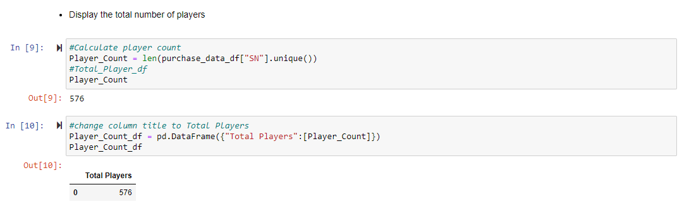
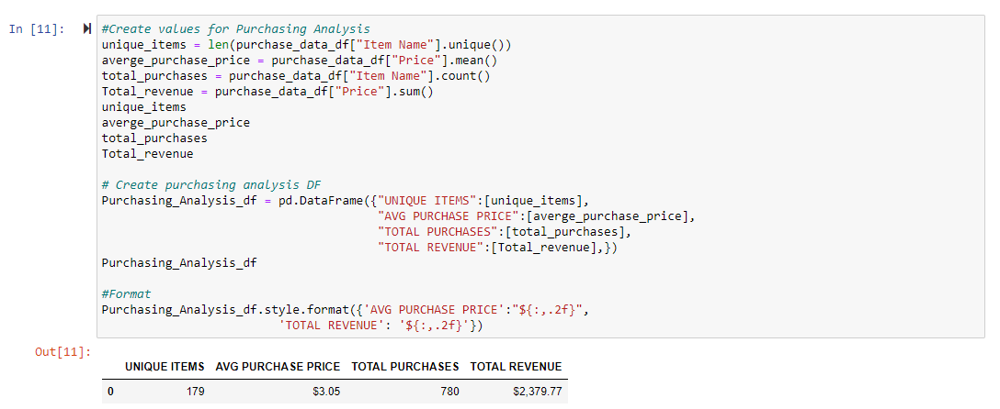
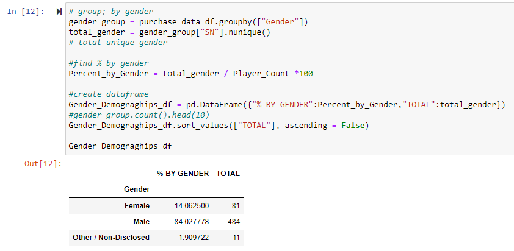
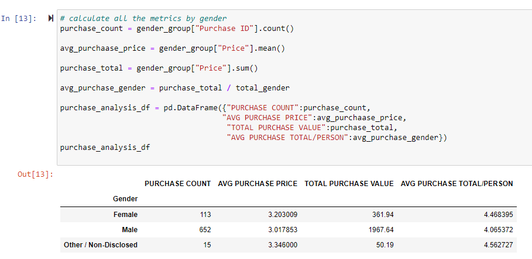
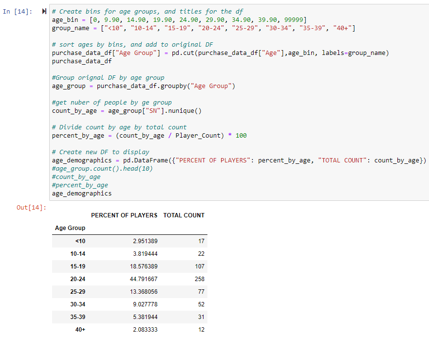
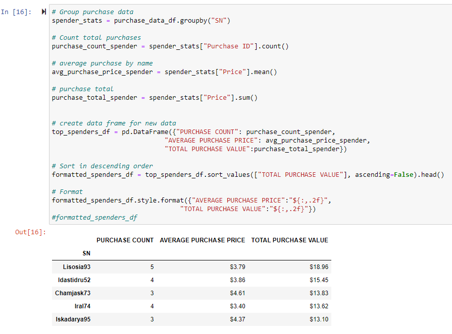
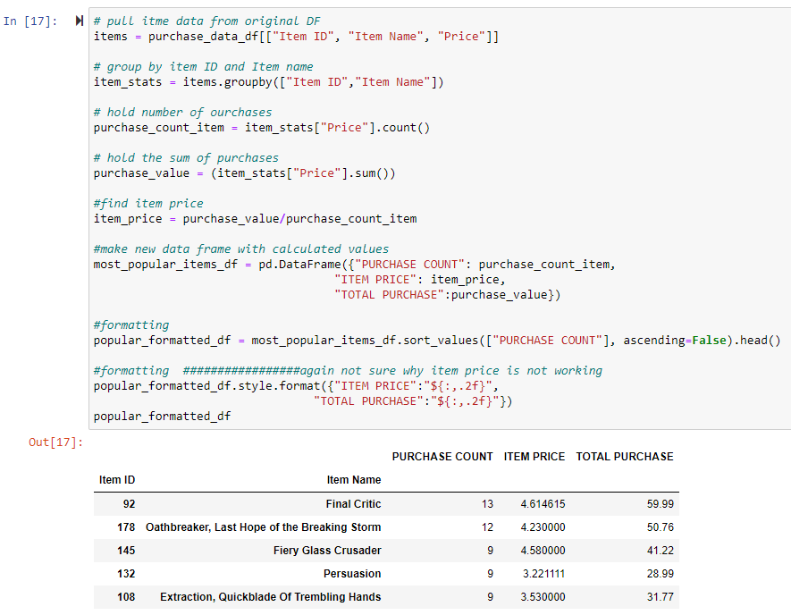

# Pandas Homework - Pandas, Pandas, Pandas

## Background

Use Python and Pandas to help a video game company analyze data about their newest video game release. The code and output for the analysis is below:

### Player Count

### Purchasing Analysis (Total)

### Gender Demographics

### Purchasing Analysis (Gender)

### Age Demographics

### Top Spenders

### Most Popular Items

### Most Profitable Items

As final considerations:

* You must use the Pandas Library and the Jupyter Notebook.
* You must submit a link to your Github/Git Lab repo that contains your Jupyter Notebook.
* You must include a written description of three observable trends based on the data.
* See [Example Solution](HeroesOfPymoli/HeroesOfPymoli_starter.ipynb) for a reference on expected format.
